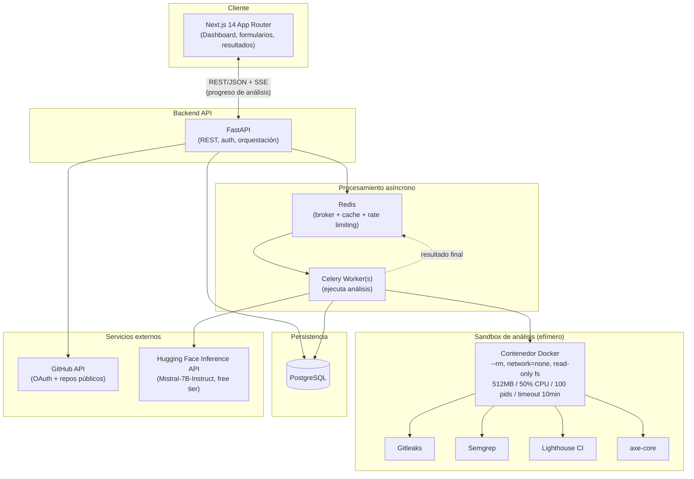
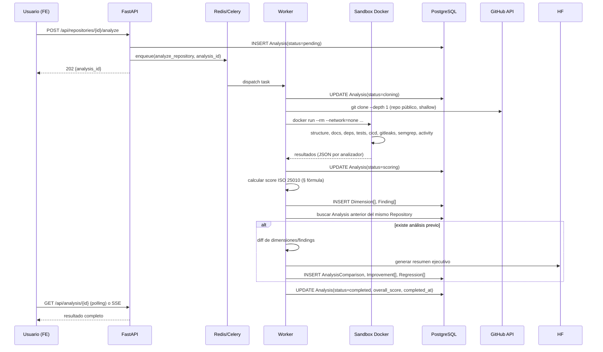

# QalitiRadar — Arquitectura Técnica

> Spec de origen: [`context/claude.md`](../context/claude.md) + decisiones de MVP acordadas el 2026-08-27 (ver tabla de decisiones al final de este documento).

## 1. Estado del repositorio (importante)

Esta carpeta (`QalitiRadar/`) actualmente solo contiene `context/claude.md`. **No está inicializada como repo git propio** — está anidada dentro de `proyectos/`, cuyo `.git` apunta a `github.com/Apollored7/proyecto-app-habitos` (un proyecto distinto, la app de hábitos). El spec indica que QalitiRadar vive en `github.com/Ashdamy/QalitiRadar`.

Antes de la Fase 1 (Task 1 del plan de implementación) hay que:
1. Inicializar un repo git nuevo dentro de `QalitiRadar/` (no reutilizar el de `proyectos/`).
2. Conectar el remote a `https://github.com/Ashdamy/QalitiRadar`.

Esto se deja como primer paso explícito del plan de Fase 1, no se hace en este documento.

## 2. Visión de componentes

**Responsabilidades por componente:**

| Componente | Responsabilidad | No hace |
|---|---|---|
| Next.js (frontend) | UI, formularios de análisis, polling/SSE de progreso, render de dashboard/histórico/comparación | No llama directamente a Gitleaks/Semgrep/Lighthouse; todo pasa por la API |
| FastAPI (API) | Auth (JWT + GitHub OAuth), CRUD de `Repository`/`DeployedApp`, encolar análisis, exponer resultados, rate limiting (vía Redis), servir reportes compartidos | No ejecuta análisis en el proceso del request (todo es async vía Celery) |
| Celery Worker | Orquesta el ciclo de vida de un análisis: clona repo o hace fetch de URL, lanza contenedor sandbox, recolecta resultados de cada analizador, calcula score ISO 25010, genera comparación con el análisis anterior, llama a HF para el resumen | No expone puertos HTTP directamente |
| Sandbox Docker | Ejecuta las herramientas de análisis sobre código/URL de terceros de forma aislada | Nunca ejecuta build/test del proyecto analizado (ver §4 riesgos) |
| PostgreSQL | Persistencia de todas las entidades (§3) | — |
| Redis | Cola de tareas (Celery broker), cache de resultados, contadores de rate limit (sliding window) | No es la fuente de verdad de resultados (eso es Postgres) |
| GitHub API | Listar repos públicos del usuario autenticado, leer metadata de commits | Solo repos públicos en MVP (scope `public_repo`) |
| Hugging Face Inference API | Generar resúmenes ejecutivos de comparaciones entre análisis | Si falla o no hay API key → fallback a plantillas predefinidas (ver `summary_service.py`) |

## 3. Flujos de datos

### 3.1 Análisis de repositorio (Modo 1)

### 3.2 Análisis de URL (Modo 2)

Igual de forma, pero sin clonado: el worker valida la URL (SSRF checks, §4.3), lanza el contenedor sandbox con Lighthouse CI + axe-core apuntando a la URL pública, y aplica los pesos de la tabla de URL. No requiere `user_id` (permitido anónimo según el spec), pero sí pasa por rate limiting por IP.

### 3.3 Análisis combinado (Modo 3)

Se ejecutan 3.1 y 3.2 en paralelo (dos tareas Celery), y una tercera tarea espera ambos resultados (`chord` de Celery) para calcular el promedio ponderado y la discrepancia (`Discrepancy`, umbral >15 puntos).

## 4. Riesgos técnicos y de seguridad (identificados y mitigación)

### 4.1 Sandbox de ejecución (el punto más sensible del sistema)

| Riesgo | Mitigación en MVP |
|---|---|
| Escape de contenedor | `--network=none`, `--read-only` + tmpfs para directorio de trabajo, `--cap-drop=ALL`, `--security-opt=no-new-privileges`, sin `--privileged`, usuario no-root dentro del contenedor |
| Agotamiento de recursos (fork bomb, disco) | `--memory=512m --memory-swap=512m --cpus=0.5 --pids-limit=100`, `--storage-opt size=1g` si el driver lo soporta, timeout duro de 10 min (Celery `task_time_limit` + `SIGKILL` del contenedor si no responde) |
| El contenedor nunca se limpia (leak) | `--rm` siempre, más un job de barrido (`docker container prune` programado) como red de seguridad si `--rm` falla por crash del host |
| Comando/argumentos inyectados desde nombre de repo/branch | Nunca construir comandos con f-strings/`shell=True`; usar `subprocess.run([...], shell=False)` con listas de argumentos; validar `branch`/`commit_hash` contra regex estricta antes de pasarlos |
| El código analizado nunca debe ejecutarse (build/test/install) | Gitleaks, Semgrep, npm audit/pip-audit y el escaneo de estructura son **estáticos** — el MVP explícitamente NO ejecuta `npm install`, `npm test` ni build del repo del usuario. Esto es una decisión de diseño, no solo de sandboxing |
| Docker socket expuesto al worker = escape trivial a host | El worker NO monta `/var/run/docker.sock` directamente; usa una API intermedia (`sandbox.py`) que invoca `docker run` con lista fija de flags, sin permitir que el worker construya el comando dinámicamente desde input de usuario |

Nota de la decisión ya tomada: Docker con límites es válido para MVP; gVisor/Firecracker quedan documentados como upgrade de Fase futura (aislamiento a nivel de kernel, no solo cgroups/namespaces).

### 4.2 GitHub OAuth

- Scopes mínimos: `public_repo read:user user:email` (ya decidido). No pedir `repo` hasta que se soporten privados.
- Almacenar `github_access_token` cifrado en reposo (Fernet/AES con clave en variable de entorno, nunca en el JSON de `raw_data`).
- Revocación: si el usuario borra su cuenta o desconecta GitHub, invalidar el token localmente y llamar al endpoint de revocación de GitHub.
- Nunca loguear el token completo (redactar en logs de la API y del worker).

### 4.3 SSRF en análisis de URL — riesgo crítico no explicitado en el spec original

Analizar una URL arbitraria provista por el usuario es el vector clásico de SSRF (Server-Side Request Forgery): el worker termina haciendo requests HTTP desde la propia infraestructura hacia donde el atacante diga.

Mitigación obligatoria (más estricta que "bloquear por string" el spec original):
1. Resolver DNS de la URL **antes** de conectar y validar que la(s) IP(s) resultantes no sean privadas/loopback/link-local (`10.0.0.0/8`, `172.16.0.0/12`, `192.168.0.0/16`, `127.0.0.0/8`, `169.254.0.0/16` — este último bloquea metadata de cloud como `169.254.169.254`).
2. Repetir la validación en **cada redirect** (una URL pública puede redirigir a `http://169.254.169.254/`), no solo en la URL inicial.
3. Bloquear esquemas distintos de `http`/`https` (`file://`, `gopher://`, etc.).
4. El contenedor que ejecuta Lighthouse/axe-core corre con `--network` restringido a salida únicamente (no puede recibir conexiones entrantes), y sin acceso a la red interna del propio QalitiRadar (para que no pueda alcanzar Postgres/Redis).

### 4.4 Rate limiting y abuso

- Contadores en Redis (sliding window) por `user_id` (o IP para anónimos): 5/hora, 20/día, 2 en paralelo — según decisión ya tomada.
- Los límites se verifican en la API **antes** de encolar la tarea (fail fast), no en el worker.

### 4.5 Datos y privacidad

- El código clonado y los artefactos del análisis se eliminan del filesystem del worker al finalizar (o fallar) el análisis — solo persiste el `raw_data` JSON resumido en Postgres, no el código fuente.
- `shared_reports` (links públicos temporales) expiran (`expires_at`) y se generan con un token aleatorio de 32 bytes (no incremental, no adivinable).

## 5. Tabla de decisiones de MVP (referencia)

| Pregunta | Decisión MVP | Fase futura |
|---|---|---|
| Sandbox | Docker con límites (`sandbox.py`) | Firecracker/gVisor |
| Repos | Solo públicos (`public_repo` scope) | Privados (Fase 2) |
| IA resúmenes | Hugging Face Inference API (Mistral-7B-Instruct-v0.3, free tier) + fallback a plantillas | HF Pro o Claude API (Fase 3) |
| URLs con login | No soportadas | Tokens del usuario (Fase 3) |
| Monetización | 100% gratis, límites 5/h · 20/día · 2 paralelos · retención 10 análisis o 90 días | Tiers de pago (Fase 3) |
| Benchmarking | Datos simulados por lenguaje (`benchmark_data`, `is_simulated=true`) | Datos reales con 100+ repos analizados |

## 6. Documentos relacionados

- Modelo de datos completo: [`DATA_MODEL.md`](./DATA_MODEL.md)
- Roadmap semana a semana: [`ROADMAP.md`](./ROADMAP.md)
