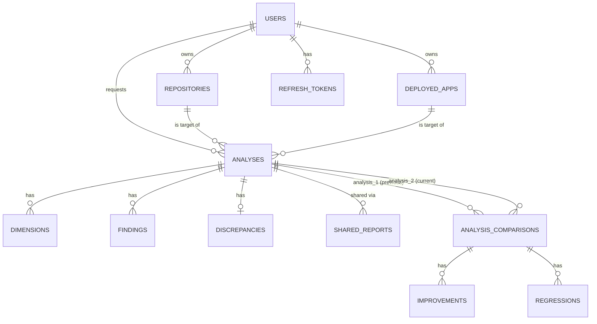

# QalitiRadar — Modelo de Datos

> Complementa [`ARCHITECTURE.md`](./ARCHITECTURE.md). PostgreSQL, IDs `UUID` (default `gen_random_uuid()`, extensión `pgcrypto`), timestamps `TIMESTAMPTZ`.

## 1. Diagrama entidad-relación



## 2. Tipos enumerados

```sql
CREATE TYPE analysis_type AS ENUM ('repository', 'url', 'combined');

CREATE TYPE analysis_status AS ENUM (
    'pending', 'cloning', 'running', 'scoring', 'completed', 'failed', 'timeout'
);

CREATE TYPE finding_severity AS ENUM ('critical', 'high', 'medium', 'low', 'info');

CREATE TYPE finding_type AS ENUM (
    'security', 'test_coverage', 'documentation', 'dependency',
    'cicd', 'structure', 'activity',
    'performance', 'accessibility', 'seo', 'compatibility', 'usability'
);

CREATE TYPE plan_tier AS ENUM ('free');  -- se amplía en Fase 3 (paid tiers)
```

## 3. Tablas

### 3.1 `users`

```sql
CREATE TABLE users (
    id UUID PRIMARY KEY DEFAULT gen_random_uuid(),
    email VARCHAR(255) NOT NULL UNIQUE,
    password_hash VARCHAR(255),              -- NULL si el usuario solo usa GitHub OAuth
    github_id BIGINT UNIQUE,
    github_username VARCHAR(255),
    github_access_token_encrypted TEXT,      -- cifrado (Fernet), nunca en claro
    avatar_url TEXT,
    plan plan_tier NOT NULL DEFAULT 'free',
    created_at TIMESTAMPTZ NOT NULL DEFAULT now(),
    updated_at TIMESTAMPTZ NOT NULL DEFAULT now(),
    CONSTRAINT users_auth_method_chk CHECK (password_hash IS NOT NULL OR github_id IS NOT NULL)
);
```
*Índices:* `UNIQUE(email)`, `UNIQUE(github_id)` (ya cubiertos por las constraints de columna).

### 3.2 `repositories`

```sql
CREATE TABLE repositories (
    id UUID PRIMARY KEY DEFAULT gen_random_uuid(),
    user_id UUID NOT NULL REFERENCES users(id) ON DELETE CASCADE,
    github_id BIGINT NOT NULL,
    name VARCHAR(255) NOT NULL,
    full_name VARCHAR(500) NOT NULL,          -- "owner/repo"
    default_branch VARCHAR(255) NOT NULL DEFAULT 'main',
    is_private BOOLEAN NOT NULL DEFAULT false,
    last_analyzed_at TIMESTAMPTZ,
    created_at TIMESTAMPTZ NOT NULL DEFAULT now(),
    UNIQUE (user_id, github_id)
);
CREATE INDEX idx_repositories_user_id ON repositories(user_id);
```
Nota: `is_private` se guarda aunque el MVP rechace analizar privados (ver `CHECK` a nivel de servicio, no de DB, porque GitHub puede cambiar la visibilidad de un repo entre análisis).

### 3.3 `deployed_apps`

```sql
CREATE TABLE deployed_apps (
    id UUID PRIMARY KEY DEFAULT gen_random_uuid(),
    user_id UUID REFERENCES users(id) ON DELETE CASCADE,  -- NULL = análisis anónimo (Modo 2 permite sin login)
    name VARCHAR(255),
    url TEXT NOT NULL,
    last_analyzed_at TIMESTAMPTZ,
    created_at TIMESTAMPTZ NOT NULL DEFAULT now()
);
CREATE INDEX idx_deployed_apps_user_id ON deployed_apps(user_id);
CREATE INDEX idx_deployed_apps_url ON deployed_apps(url);
```

### 3.4 `analyses`

```sql
CREATE TABLE analyses (
    id UUID PRIMARY KEY DEFAULT gen_random_uuid(),
    user_id UUID REFERENCES users(id) ON DELETE SET NULL,
    repository_id UUID REFERENCES repositories(id) ON DELETE CASCADE,
    app_id UUID REFERENCES deployed_apps(id) ON DELETE CASCADE,
    analysis_type analysis_type NOT NULL,
    status analysis_status NOT NULL DEFAULT 'pending',
    overall_score NUMERIC(5,2),
    confidence_level NUMERIC(5,2),
    commit_hash VARCHAR(40),
    commit_message TEXT,
    branch VARCHAR(255),
    raw_data JSONB,
    error_message TEXT,
    started_at TIMESTAMPTZ,
    completed_at TIMESTAMPTZ,
    created_at TIMESTAMPTZ NOT NULL DEFAULT now(),
    CONSTRAINT analyses_target_chk CHECK (
        (repository_id IS NOT NULL AND app_id IS NULL) OR
        (repository_id IS NULL AND app_id IS NOT NULL) OR
        (repository_id IS NOT NULL AND app_id IS NOT NULL)  -- combinado
    )
);
CREATE INDEX idx_analyses_repository_timeline ON analyses(repository_id, created_at DESC);
CREATE INDEX idx_analyses_app_timeline ON analyses(app_id, created_at DESC);
CREATE INDEX idx_analyses_user_created ON analyses(user_id, created_at DESC);
CREATE INDEX idx_analyses_status ON analyses(status) WHERE status IN ('pending', 'cloning', 'running', 'scoring');
```
El índice parcial en `status` acelera el polling de "análisis en curso" sin escanear los completados/fallidos, que son la mayoría con el tiempo.

### 3.5 `dimensions`

```sql
CREATE TABLE dimensions (
    id UUID PRIMARY KEY DEFAULT gen_random_uuid(),
    analysis_id UUID NOT NULL REFERENCES analyses(id) ON DELETE CASCADE,
    name VARCHAR(50) NOT NULL,   -- p.ej. 'security', 'maintainability', 'performance'
    score NUMERIC(5,2) NOT NULL CHECK (score >= 0 AND score <= 100),
    weight NUMERIC(4,3) NOT NULL CHECK (weight > 0 AND weight <= 1),
    raw_metrics JSONB,
    UNIQUE (analysis_id, name)
);
CREATE INDEX idx_dimensions_analysis_id ON dimensions(analysis_id);
```

### 3.6 `findings`

```sql
CREATE TABLE findings (
    id UUID PRIMARY KEY DEFAULT gen_random_uuid(),
    analysis_id UUID NOT NULL REFERENCES analyses(id) ON DELETE CASCADE,
    type finding_type NOT NULL,
    severity finding_severity NOT NULL,
    title VARCHAR(500) NOT NULL,
    description TEXT NOT NULL,
    file_path TEXT,
    url TEXT,
    recommendation TEXT,
    created_at TIMESTAMPTZ NOT NULL DEFAULT now()
);
CREATE INDEX idx_findings_analysis_id ON findings(analysis_id);
CREATE INDEX idx_findings_analysis_severity ON findings(analysis_id, severity);
```

### 3.7 `discrepancies` (solo para `analysis_type = 'combined'`)

```sql
CREATE TABLE discrepancies (
    id UUID PRIMARY KEY DEFAULT gen_random_uuid(),
    analysis_id UUID NOT NULL UNIQUE REFERENCES analyses(id) ON DELETE CASCADE,
    repo_score NUMERIC(5,2) NOT NULL,
    url_score NUMERIC(5,2) NOT NULL,
    delta NUMERIC(5,2) NOT NULL,   -- repo_score - url_score
    explanation TEXT NOT NULL,
    recommendations TEXT
);
```

### 3.8 `analysis_comparisons`

```sql
CREATE TABLE analysis_comparisons (
    id UUID PRIMARY KEY DEFAULT gen_random_uuid(),
    analysis_1_id UUID NOT NULL REFERENCES analyses(id) ON DELETE CASCADE,  -- anterior
    analysis_2_id UUID NOT NULL REFERENCES analyses(id) ON DELETE CASCADE,  -- actual
    score_delta NUMERIC(5,2) NOT NULL,
    improvements_count INT NOT NULL DEFAULT 0,
    regressions_count INT NOT NULL DEFAULT 0,
    summary_text TEXT,
    created_at TIMESTAMPTZ NOT NULL DEFAULT now(),
    UNIQUE (analysis_1_id, analysis_2_id)
);
CREATE INDEX idx_comparisons_analysis_2 ON analysis_comparisons(analysis_2_id);
```
`idx_comparisons_analysis_2` permite responder rápido "¿cuál es la comparación más reciente de este análisis?" (caso de uso más frecuente que buscar por `analysis_1_id`).

### 3.9 `improvements` / `regressions`

```sql
CREATE TABLE improvements (
    id UUID PRIMARY KEY DEFAULT gen_random_uuid(),
    comparison_id UUID NOT NULL REFERENCES analysis_comparisons(id) ON DELETE CASCADE,
    dimension VARCHAR(50) NOT NULL,
    previous_score NUMERIC(5,2),
    current_score NUMERIC(5,2),
    delta NUMERIC(5,2) NOT NULL,
    description TEXT NOT NULL,
    evidence JSONB
);
CREATE INDEX idx_improvements_comparison_id ON improvements(comparison_id);

CREATE TABLE regressions (
    id UUID PRIMARY KEY DEFAULT gen_random_uuid(),
    comparison_id UUID NOT NULL REFERENCES analysis_comparisons(id) ON DELETE CASCADE,
    dimension VARCHAR(50) NOT NULL,
    previous_score NUMERIC(5,2),
    current_score NUMERIC(5,2),
    delta NUMERIC(5,2) NOT NULL,
    description TEXT NOT NULL,
    evidence JSONB,
    severity finding_severity NOT NULL
);
CREATE INDEX idx_regressions_comparison_id ON regressions(comparison_id);
```

### 3.10 `benchmark_data` (decisión: datos simulados en MVP)

```sql
CREATE TABLE benchmark_data (
    id UUID PRIMARY KEY DEFAULT gen_random_uuid(),
    language VARCHAR(50) NOT NULL,     -- 'javascript', 'python', 'typescript', ...
    dimension VARCHAR(50) NOT NULL,
    avg_score NUMERIC(5,2) NOT NULL,
    source VARCHAR(255) NOT NULL,      -- p.ej. "State of Open Source 2025 (simulado)"
    is_simulated BOOLEAN NOT NULL DEFAULT true,
    updated_at TIMESTAMPTZ NOT NULL DEFAULT now(),
    UNIQUE (language, dimension)
);
```

### 3.11 `shared_reports` (compartir reporte — link público temporal)

```sql
CREATE TABLE shared_reports (
    id UUID PRIMARY KEY DEFAULT gen_random_uuid(),
    analysis_id UUID NOT NULL REFERENCES analyses(id) ON DELETE CASCADE,
    token VARCHAR(64) NOT NULL UNIQUE,   -- secrets.token_urlsafe(32)
    expires_at TIMESTAMPTZ NOT NULL,
    created_at TIMESTAMPTZ NOT NULL DEFAULT now()
);
CREATE INDEX idx_shared_reports_token ON shared_reports(token);
```

### 3.12 `refresh_tokens` (sesión JWT)

```sql
CREATE TABLE refresh_tokens (
    id UUID PRIMARY KEY DEFAULT gen_random_uuid(),
    user_id UUID NOT NULL REFERENCES users(id) ON DELETE CASCADE,
    token_hash VARCHAR(255) NOT NULL,   -- hash del refresh token, nunca en claro
    expires_at TIMESTAMPTZ NOT NULL,
    revoked BOOLEAN NOT NULL DEFAULT false,
    created_at TIMESTAMPTZ NOT NULL DEFAULT now()
);
CREATE INDEX idx_refresh_tokens_user_id ON refresh_tokens(user_id);
CREATE INDEX idx_refresh_tokens_hash ON refresh_tokens(token_hash);
```

## 4. Notas de diseño

- **Rate limiting NO vive en Postgres**: se implementa como contadores Redis (`INCR` + `EXPIRE`, sliding window) por `user_id` o IP. Ponerlo en una tabla SQL generaría escrituras de alta frecuencia innecesarias en la base transaccional.
- **`raw_data JSONB` en `analyses`**: guarda la salida cruda combinada de todos los analizadores para esa corrida, útil para debugging y para recalcular el score si cambia la fórmula de ponderación sin re-ejecutar el análisis. No sustituye a `dimensions`/`findings`, que son la vista normalizada y consultable.
- **Límite de 50 análisis históricos por repo / retención 90 días** (regla de negocio ya decidida): se implementa como job periódico (Celery beat) que borra `analyses` más allá del límite, nunca en el path caliente de creación. El `ON DELETE CASCADE` en `dimensions`/`findings`/`analysis_comparisons` limpia automáticamente los hijos.
- **`analysis_comparisons` es dirigida** (`analysis_1_id` = anterior, `analysis_2_id` = actual), no simétrica — importante para que "mejora" vs "regresión" tenga sentido consistente.

## 5. Migraciones (Alembic)

Orden sugerido de migraciones iniciales (cada una debe ser reversible):
1. `0001_enable_pgcrypto` — `CREATE EXTENSION IF NOT EXISTS pgcrypto;`
2. `0002_create_enums`
3. `0003_create_users`
4. `0004_create_repositories_and_apps`
5. `0005_create_analyses`
6. `0006_create_dimensions_and_findings`
7. `0007_create_discrepancies`
8. `0008_create_comparisons_improvements_regressions`
9. `0009_create_benchmark_data` (+ seed inicial con datos simulados)
10. `0010_create_shared_reports_and_refresh_tokens`
